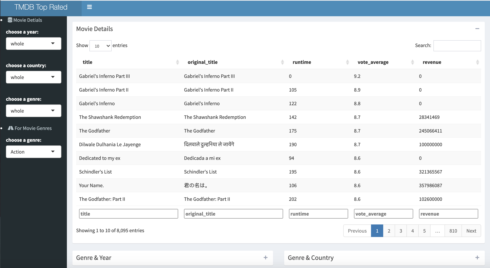

```{r setup, include=FALSE}
knitr::opts_chunk$set(echo = FALSE,fig.align = 'center',message = FALSE,warning = FALSE,error = FALSE,results = 'asis')
library(lubridate)
library(dplyr)
library(stringr)
library(XML)
library(RCurl)
library(ggplot2)
library(ggthemes)
library(gridExtra)
library(kableExtra)
library(arm)
library(readr)
library(ggthemr)
```


```{r}
main=read.csv("top_rate_full.csv")
```

```{r}
#observe
language_num <- str_count(main$spoken_language, "\\)")
lan_max = max(unique(language_num))
#max=10

#split into 10 cols
language_df = str_split_fixed(main$spoken_language, "\\,list", lan_max)
language_df = as.data.frame(language_df,stringsAsFactors = FALSE)

#regular expression
language_name <- as.data.frame(sapply(language_df, function(x) str_remove_all(x, "list")), stringsAsFactors = F)

language_name <- as.data.frame(sapply(language_name, function(x) str_remove_all(x, "\\(english_name = ")), stringsAsFactors = F)

language_name <- as.data.frame(sapply(language_name, function(x) str_remove_all(x, '\\)')), stringsAsFactors = F)
language_name <- as.data.frame(sapply(language_name, function(x) str_remove_all(x, '\\"')), stringsAsFactors = F)


#combine Vi into one col
language_name[is.na(language_name)] <-""

main$spoken_language=str_c(language_name$V1,language_name$V2,language_name$V3,language_name$V4,language_name$V5,language_name$V6,language_name$V7,language_name$V8,language_name$V9,language_name$V10,sep=",")
```

```{r}
#observe
company_num <- str_count(main$production_companies, "list")
com_max = max(na.exclude(unique(company_num)))
#max=26

#split into 8 cols
company_df = str_split_fixed(main$production_companies, "\\,list", com_max)
company_df = as.data.frame(company_df,stringsAsFactors = FALSE)

#regular expression
company_df <- as.data.frame(sapply(company_df, function(x) str_remove_all(x, "list")), stringsAsFactors = F)
company_df <- as.data.frame(sapply(company_df, function(x) str_remove_all(x, '"')), stringsAsFactors = F)
company_df <- as.data.frame(sapply(company_df, function(x) str_remove_all(x, "(?<=\\,\\s).+(?=\\})")), stringsAsFactors = F)
company_df <- as.data.frame(sapply(company_df, function(x) str_remove_all(x, "\\{name\\s\\=\\s")), stringsAsFactors = F)
company_df <- as.data.frame(sapply(company_df, function(x) str_remove_all(x, "\\,\\s\\}")), stringsAsFactors = F)
#for one string
company_df <- as.data.frame(sapply(company_df, function(x) str_remove_all(x, "(?<=\\,).+")), stringsAsFactors = F)
company_df <- as.data.frame(sapply(company_df, function(x) str_remove_all(x, "\\,")), stringsAsFactors = F)

company_df <- as.data.frame(sapply(company_df, function(x) str_remove_all(x, "\\(")), stringsAsFactors = F)
company_df <- as.data.frame(sapply(company_df, function(x) str_remove_all(x, "\\}")), stringsAsFactors = F)
company_name=company_df

#combine Vi into one col
company_name[is.na(company_name)] <- ""

main$production_companies=str_c(company_name$V1,company_name$V2,company_name$V3,company_name$V4,company_name$V5,company_name$V6,company_name$V7,company_name$V8,company_name$V9,company_name$V10,company_name$V11,company_name$V12,company_name$V13,company_name$V14,company_name$V15,company_name$V16,company_name$V17,company_name$V18,company_name$V19,company_name$V20,company_name$V21,company_name$V22,company_name$V23,company_name$V24,company_name$V25,company_name$V26,sep=",")
```

```{r}
main$release_year=year(main$release_date)
main$release_month=month(main$release_date)
#write.csv(main,"movie_newest.csv")
```

## Introduction

In this project, I will try to gain some insights into the movie industry.

I divide my work into four parts:

- Data Collection

- Data Cleaning And Organization

- Exploration And Findings

- Shiny App


## Dataset

### Data Description

My dataset contain metadata for all 8,095 movies in the TMDB Top Rated movie Database (before 12/12/2020). The data points include as the following: 

- **budget**: The budget of the movie in dollars.

- **genres**: A stringified list of dictionaries that list out all the genres associated with the movie.

- **id**: The ID of the move.

- **original_language**: The language in which the movie was originally shot in.

- **original_title**: The original title of the movie.

- **overview**: A brief blurb of the movie.

- **popularity**: The Popularity Score assigned by TMDB.

- **production_companies**: A stringified list of production companies involved with the making of the movie.

- **production_countries**: A stringified list of countries where the movie was shot/produced in.

- **release_date**: Theatrical Release Date of the movie.

- **revenue**: The total revenue of the movie in dollars.

- **runtime**: The runtime of the movie in minutes.

- **spoken_languages**: A stringified list of spoken languages in the film.

- **title**: The Official Title of the movie.

- **vote_average**: The average rating of the movie.

- **vote_count**: The number of votes by users, as counted by TMDB.

### Data Collection

I gain these data from the [TMDB API](https://www.themoviedb.org/documentation/api). I use `rjson`, `RCUrl` and `httr` package to scrap in R.
The first step is to scrap the top-rate movie dataset, getting the tmdb_id list. Then, use the tmdb_id list as the parameter to re-scrap more information on the TMDB Movie Detail Database. The data collection R file is in github [TMDB API.R](https://github.com/wendylzw/MA615/blob/main/Final%20Project/TMDB%20API.R).

### Data Cleaning

Variables `genres`,`production_companies`,`production_contries`,`spoken_languages` are in JSON format. It's hard to use directly in R. So I use both Excel and R to transform them.

In R, I use `str_extract`, `str_c`, `str_split` functions in `stringr` package to extract values with regular expressions.

So the final format is:    

\includegraphics{table.png}


## Exploration And Findings

#### Country  

<div align=center>

- As we all known, the **U.S** is the biggest film-making country in the world. In the TMDB Top Rate Movie Dataset, there are 5884 top-rated movies from the U.S.

- The film industry in **Europe** has also well developed. In particular, **U.K.** and **France** are the two most popular film-making countries in the world, just smaller than the U.S..

- In **Asia**, movies produced from **Japan** and **China** are the two biggest good film-making countries, followed by **India**. 

```{r}
#observe
country_num <- str_count(main$production_countries, "\\,")
cou_max = max(na.exclude(unique(country_num)))+1
#max=25

#split into 8 cols
country_df = str_split_fixed(main$production_countries, ",", cou_max)
country_name  = as.data.frame(country_df,stringsAsFactors = FALSE)


#combine Vi into one col
country_name[is.na(country_name)] <- ""
```

```{r}
country_count_df = as.data.frame(table(unlist(country_name)), stringsAsFactors = F)
country_count_df = country_count_df[2:nrow(country_count_df),]
country_count_df$Freq = as.numeric(country_count_df$Freq)

country_count_df = country_count_df[order(country_count_df$Freq,decreasing = T),]
```


```{r }
library(devtools)
#install_github('lchiffon/REmap')
#https://blog.csdn.net/wzgl__wh/article/details/53108754
library(REmap)
data = data.frame(country = country_count_df$Var1,
                   value = country_count_df$Freq)
library(ggthemr)
out=remapC(data,maptype = "world",color=c("red","orange","#db735c","white"),theme=get_theme(theme="none",backgroundColor = "white"),title = "Movie Production Country Map",subtitle = "Movie Production Country Map",mindata = min(data$value),maxdata = max(data$value))
```


#### Genre

```{r }
#observe
genre_num <- str_count(main$genres, "\\,")
genre_max = max(na.exclude(unique(genre_num)))+1
#max=8

#split into 8 cols
genre_df = str_split_fixed(main$genres, ",", genre_max)
genre_name = as.data.frame(genre_df,stringsAsFactors = FALSE)
   
#combine V1-V8 into one col
genre_name[is.na(genre_name)] <- ""
```

##### 1. Which are the most commonly occurring genres?  
  
- **Drama** is the most genre with 17.5% proportion among all the top-rated movies.

- **Comedy** is the second most genre with 14.6% proportion and **Thriller** is the third most genre with 10.5% proportion.

- The top 10 genres are Drama, Comedy, Thriller,Romance, Action, Horror, Crime, Adventure, Science Fiction and Family.

```{r fig.height=4,fig.width=8}
library(ggthemes)
#devtools::install_github('cttobin/ggthemr')
library(ggthemr)
library(scales)

genre_count_df = as.data.frame(table(unlist(genre_name)), stringsAsFactors = F)
genre_count_df = genre_count_df[2:nrow(genre_count_df),]

ggthemr('dust',type = "outer") #https://www.cnblogs.com/feffery/p/10393566.html
ggplot(data=genre_count_df, aes(x = reorder(Var1, Freq),y = Freq)) +
  geom_bar(stat = "identity") +
  coord_flip()+
  xlab("") +
  ylab("Movie Number") +
  ggtitle("Count Of The Movie Genres") +
  geom_label(aes(label=as.character(percent(Freq/sum(Freq),accuracy = 0.1))),size=2)+
  theme(legend.position="none",
        plot.title=element_text(hjust=0.5))

```

##### 2. Which genres have the highest revenue?  
  
From this bar plot, it seems like large difference of revenue and budget between all the genres.

- **Adventure** and **Fantasy** movies have the highest revenue and budget.

- **Documentary** and **Foreign** movies have the lowest revenue and budget.

-  Return(revenue/budget) indicates which kind of movies are profitable. Among the top-rated movies, **Music** is the most profitable genre, whose return is lager than 4. **Animation** and **Romance** rank second and third profitable genres. **Western** has the least return, followed by **History** and **War**. I think these kinds of movies need many grandeur that take too many money. 

P.S. Since our dataset describes the top-rated movies, I guess the returns are lager than the average value of the industry. 


```{r fig.height=4,fig.width=8}
genre_count_df$revenue = NA 

  for(i in 1:nrow(genre_count_df)){
  gg = main %>% filter(str_detect(main$genres,genre_count_df$Var1[i])==TRUE)
  genre_count_df$revenue[i] = mean(gg$revenue)
  }

genre_count_df$budget = NA
  for(i in 1:nrow(genre_count_df)){
  gg = main %>% filter(str_detect(main$genres,genre_count_df$Var1[i])==TRUE)
  genre_count_df$budget[i] = mean(gg$budget)
  }

genre_count_df$return = NA
  for(i in 1:nrow(genre_count_df)){
  gg = main %>% filter(str_detect(main$genres,genre_count_df$Var1[i])==TRUE)
  genre_count_df$return[i] = mean(gg$revenue)/mean(gg$budget)
  }

library(ggthemr)
ggthemr('dust',type = "outer") 

library(reshape)
genre_melt_df=melt(as.data.frame(genre_count_df[,c(1,3,4)]),id.vars = 'Var1')
ggplot(data=genre_melt_df, aes(x = reorder(Var1, value),y = value)) +
  geom_bar(aes(fill=variable),stat = "identity",position = "dodge") +
  coord_flip()+
  xlab("") +
  ylab("Revenue/Budget") +
  ggtitle("Genre: Mean Revenue And Budget") +
  theme(plot.title=element_text(hjust=0.5),legend.title = element_blank())

ggplot(data=genre_count_df, aes(x = reorder(Var1,return),y = return)) +
  geom_point(aes(size=return),alpha=0.8) +
  coord_flip()+
  xlab("") +
  ylab("Return") +
  ggtitle("Genre: Mean Return") +
  theme(legend.position="none",
        plot.title=element_text(hjust=0.5))
```


#### Year & Month

##### 1.Which years and months released most movies?

- The number of released movies are increasing in the recent 20 years, which indicates that the film industry in the world is thriving.  

- It seems like summer is a popular movie season since there are many movie released from **August** to **October**.

```{r fig.height=3,fig.width=8}
library(pheatmap)
a=table(main$release_month[main$release_year>2000],main$release_year[main$release_year>2000])
pheatmap(a,cluster_rows=FALSE,cluster_cols = FALSE,display_numbers = TRUE,number_format = "%.0f",main="Movise Number Heatmap")
```


##### 2.Which years and months have the highest revenue?

```{r fig.height=4,fig.width=8}
b=main %>% group_by(release_month) %>% summarise(revenue = mean(revenue))
bb=main %>% group_by(release_year) %>% summarise(revenue = mean(revenue))

ggthemr('dust',type = "outer") 
p1=ggplot(data=bb,aes(x=release_year,y=revenue))+
  geom_line()+
  xlab("Release Year") +
  ylab("Revenue") +
  xlim(c(min(main$release_year,na.rm = TRUE),max(main$release_year,na.rm = TRUE)))+
  ggtitle("Mean Revenue Of Each Year") +
  theme(legend.position="none",
        plot.title=element_text(hjust=0.5),
        axis.title = element_text(size=10),
        axis.text.x = element_text(hjust=0.7))

p2=ggplot(data=b)+
  geom_bar(aes(x=release_month,y=revenue),stat = "identity",width = 0.5)+
  xlab("Release Month") +
  ylab("Revenue") +
  ggtitle("Mean Revenue Of Each Month") +
  theme(legend.position="none",
        plot.title=element_text(hjust=0.5),
        axis.title = element_text(size=10))

cowplot::plot_grid(p1,p2,nrow = 2)
```

- During the very early period , the revenues are in very low level. It's easy to understand, Surprisingly, there are several climax: 1937,1939,1942,1951 before 1950s. **Why?** I guess some outstanding movies were released in these years which made the average revenue higher. So, it cannot represent the entire movie revenue case at that time.

- After 1950s, the average revenue has an increasing trend among years. After the 20th century, the annual average revenue has stayed stable.

- Now, we discuss the monthly average revenue. From the second plot, it seems like **May** to **July** have the highest average revenue. This can be attributed to the fact that **blockbuster movies** are usually released in the summer when the kids are out of school and the parents are on vacation and therefore, the audience is more likely to spend their disposable income on entertainment. Moreover, these event movies are always high rated by audiences.


#### Production Company
```{r}
company_count_df = as.data.frame(table(unlist(company_name)), stringsAsFactors = F)
company_count_df = company_count_df[2:nrow(company_count_df),]
company_count_df$Freq = as.numeric(company_count_df$Freq)

## top 1000 produce companies
company_count_df = head(company_count_df[order(company_count_df$Freq,decreasing = T),],1000)

#company_count_df =separate(company_count_df,Var1,c("company","company_country"),sep = "/",remove = FALSE)

company_count_df$revenue = NA 
  for(i in 1:nrow(company_count_df)){
  gg = main %>% filter(str_count(main$production_companies,company_count_df$Var1[i])!=0)
  company_count_df$revenue[i] = mean(gg$revenue)
  }

company_count_df$total_revenue = NA
  for(i in 1:nrow(company_count_df)){
  gg = main %>% filter(str_detect(main$production_companies,company_count_df$Var1[i])==TRUE)
  company_count_df$total_revenue[i] = sum(gg$revenue)
  }

company_count_df$return = NA
  for(i in 1:nrow(company_count_df)){
  gg = main %>% filter(str_detect(main$production_companies,company_count_df$Var1[i])==TRUE)
  company_count_df$return[i] = mean(gg$revenue)/mean(gg$budget)
  }

company_count_df=company_count_df %>% filter(is.na(revenue)==FALSE)
```


##### 1. Which companies earn the highest total revenue?

```{r fig.height=5.5,fig.width=8}
company_1 = head(company_count_df[order(company_count_df$total_revenue,decreasing = T),],10)

p3=ggplot(data=company_1, aes(x = reorder(Var1,total_revenue),y = total_revenue)) +
  geom_bar(stat = "identity",position = "dodge") +
  coord_flip()+
  xlab("") +
  ylab("Total Revenue") +
  geom_label(aes(label=as.character(round(total_revenue/10^9,1))),size=2)+
  ggtitle("Top Earning Production Company") +
  theme(plot.title=element_text(hjust=0.5),legend.title = element_blank())

p4=ggplot(data=company_1, aes(x = reorder(Var1,Freq),y = Freq)) +
  geom_bar(stat = "identity",position = "dodge") +
  coord_flip()+
  xlab("") +
  ylab("Produced Movie Number") +
  geom_label(aes(label=as.character(Freq)),size=2)+
  theme(plot.title=element_text(hjust=0.5),legend.title = element_blank())
cowplot::plot_grid(p3,p4,nrow=2)
```

- Undoubtedly, **Warner Bros** is the highest revenue earning movie production company among the most 50 successful companies. It has earned $\$$ 76 billion from 537 movies.

- **Universal Pictures** and **20th Century Fox** win the silver and bronze medals respectively, with $\$$ 67.2 billion from 522 movies and with $\$$ 58.4 billion from 360 movies.


##### 2. Which companies made the highest-revenue movie?
  
- Movies made by **Lightstorm Entertainment** has the highest revenue -- $\$$ 768.5 million. Movies made by **Marvel Studios** has the second highest revenue --  $\$$ 747.1 million. We can also find familiar companies like **DC Films** that has good grossing performance.

- Movies made by **Marvel Studios** has the highest return of investment -- 490%. Movies made by **20th Century Fox** and **New Line Cinema** has the second highest return of investment -- 360%.

```{r fig.height=5.5,fig.width=8}
company_2 = head(company_count_df[order(company_count_df$revenue,decreasing = T),],10)

p5=ggplot(data=company_2, aes(x = reorder(Var1,revenue),y = revenue)) +
  geom_bar(stat = "identity",position = "dodge") +
  coord_flip()+
  xlab("") +
  ylab("Average Revenue") +
  geom_label(aes(label=as.character(round(revenue/10^6,1))),size=2)+
  ggtitle("Top Grossing Movie Production Company") +
  theme(plot.title=element_text(hjust=0.5),legend.title = element_blank())

p6=ggplot(data=company_1, aes(x = reorder(Var1,return),y = return)) +
  geom_bar(stat = "identity",position = "dodge") +
  coord_flip()+
  xlab("") +
  ylab("Return") +
  geom_label(aes(label=as.character(round(return,1))),size=2)+
  theme(plot.title=element_text(hjust=0.5),legend.title = element_blank())

cowplot::plot_grid(p5,p6,nrow=2)
```


#### Popularity, Vote Average and Vote Count

##### 1.How the vote scores distribute?

This density plot shows the distribution of TMDB users' average vote to the TMDB Top Rate Movie Dataset. It seems like most vote scores concentrates on **6.4** to **7.6**. Few top-rated movies are voted below **4.8** and beyond **8.4** scores.

```{r fig.height=3,fig.width=8}
p7=ggplot(data=main,aes(x=vote_average,y=..density..))+
  geom_histogram(alpha=0.5,bins = 20)+
  geom_density(fill="#db735c",alpha=0.2)+
  xlab("Average Vote") +
  ggtitle("Distribution Of Average Vote")+
  theme(plot.title=element_text(hjust=0.5),legend.title = element_blank())

p8=ggplot(data=main,aes(y=vote_average))+
  geom_boxplot(fill="#db735c",alpha=0.2)+
  ylab("Average Vote") +
  ggtitle("Boxplot Of Average Vote")+
  theme(plot.title=element_text(hjust=0.5),legend.title = element_blank())

cowplot::plot_grid(p7,p8,nrow=1)
```


##### 2.Dose Users get more strict along with time?

From this plot, it seems like the overall rating trend is decreasing among the years. The annual average vote has decreased from 8 to 6 scores until 2017 and has increased a little form 2018.

It's hard to say the audiences get more strict to assess a movie. There may be another explanation. There are less movies in the early year, but the percentage of high-rated movies is high. For these old movies, the TMDB users (modern people) can just notice and vote the outstanding ones while the low-quality movies are always ignored. In this case, the much higher average vote of old movies is reasonable.

```{r fig.height=4,fig.width=8}
ggplot(data=main,aes(x=release_year,y=vote_average))+
  geom_boxplot(aes(group=release_year),alpha=0.7)+
  ylab("Average Vote") +
  ggtitle("Boxplot Of Average Vote")+
  theme(plot.title=element_text(hjust=0.5),legend.title = element_blank())
```

##### 3.What are the top reputable movies?

Firstly, I filter the vote count that more than 2000. If the users who voted for a movie are too little, maybe the rating is not meaningful. Below is the top 20 reputable movies table: 

\includegraphics{vote_1.png}

```{r}
vote_1 = main %>% filter(vote_count>2000)
vote_1=head(vote_1[order(vote_1$vote_average,decreasing = T),],10)
vote_1 = vote_1 %>% dplyr::select(production_countries,title,vote_average,release_year)
```

Not surprisingly **The Shawshank Redemption** and **The Godfather** are the two highest rated movies. In fact, these two famous movies are in all kind of Top Movies Lists in the world.

It seems like the top rated movies are most old movies before 20th century. There are only two movies -- **Your Name** and **Parasite** released after 2010 rank the top 20. I believe many people are familiar with these two phenomenal movies from Asia. They are directed separately by the most famous directors in Japan and South Korea -- Makoto Niitsu and Bong Joon ho. By the way, **Parasite** won the Oscar last year.


## Shiny App

After exploring the dataset, I build an interactive web appby Shiny to present our data and plots more visually. 

On the dashboard,there are two menu items: the first one is *Movie Detail Table* with one table box, the second one is *Movie Genre Plot* with two plot boxes.
 
On the side bar, users can select the year, country and genre.

Here is the link to my app: [Final Mapping Shiny Link](https://wendy-liang.shinyapps.io/TMDB_Shiny/).


## Reference

- [R shinydashboard example](https://www.jianshu.com/p/9983b8113470)

- [TMDB API Doc](https://developers.themoviedb.org/3)

- [Kaggle full movie dataset (2017)](https://www.kaggle.com/rounakbanik/the-movies-dataset)


\newpage

## Appendix
<div align=auto>

<div align=auto>

<div align=auto>


